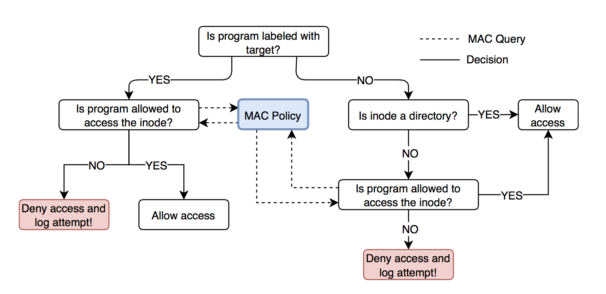

# Linux Security Modules

## Key technology and concepts
1. Linux Security Modules
2. mandatory access control
3. extended file system attributes
4. custom kernel configuration parameters
5. obtain and enforce Least Privilege Policy for /usr/bin/passwd

## Overview
This linux security module implements a mandatory access control policy for file accesses in the Linux environment. The module will only focus on programs labeled by the target label, and provide minimum access control for the remaining program. The goal of this approach is to ensure proper functioning of the virtual machine since our access control policy does not cover all the possible cases. Our module will be embedded into the kernel at build-time and we will select it as the default major security module at boot time. Additionally, we will inspect the user-space program /usr/bin/passwd and generate the Least Privilege Policy for it. We will then label our file system accordingly and verify that our security module can enforce that policy.

The above figureshows an overview of the process that happens in our security module when a program attempts to access an inode. In order to be able to enforce an access control policy, our module will require security labels on the inodes and the tasks in the system. For the inodes, we will make use of the filesystem’s (xfs in our case) extended attributes (or xattr). Extended attributes provide us with a way to associate our file with metadata that is not interpreted by the filesystem. Instead, the metadata will be interpreted by our custom security module. It is common practice for linux security modules to use extended attributes under the prefix security. In this linux security module, each inode that we care about will be assigned an attribute value under the name security.mp4.
As previously mentioned, our module specifically enforces access control for the programs that have been labeled with the target label. For those programs that are not labeled as target, our module will allow them full access to directories (regardless of the directories’ security labels), and will allow them read-only access to files that have been assigned one of our custom labels. 

## Implementation
##### Compiling and Configuring the kernel tree
I developed my own customed security module for the linux-4.4.0 kernel. For this module, I did the following steps:
1. Install necessary packages like attr
2. Add configuration options for my security module in the kernel’s Kconfig
3. Compile the kernel
4. Edit the grub configuration to make persistent change  of adding your security module as the default only major LSM.

##### Implementing and testing LSM
1. implemented linux security hooks include:
```
1. cred_alloc_blank
2. cred_prepare
3. cred_free
4. bprm_set_creds
5. inode_init_security 
6. inode_permission
```
2. Tested the module by setting extended attribute
```
setfattr -n security.mp4 -v target /bin/cat
setfattr -n security.mp4 -v dir /home
setfattr -n security.mp4 -v dir /home/test
setfattr -n security.mp4 -v read-only /home/file.txt
```
Then try read, write and other operations to test whether it is behaved as wish.

##### Obtaining the Least Privilege Policy for /usr/bin/passwd
To obtain the files and the permissions that /usr/bin/passwd requires to run correctly, I used strace tool.
1. Create a dummy user and change its password. Use strace to profile /usr/bin/passwd’s run and look at the files that it requests access to.
2. Look into the report generated by strace and figure out the files and the permissions that /usr/bin/passwd requests access to. 
3. Generate the least privilege policy for /usr/bin/passwd.
4. Load the policy.
